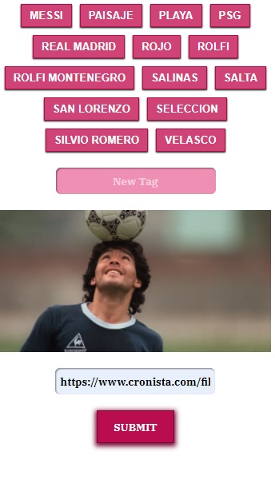
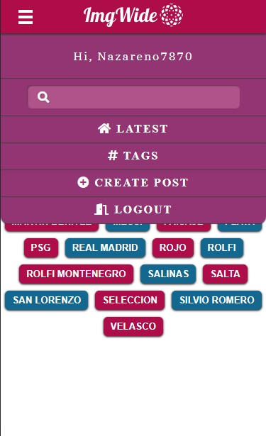
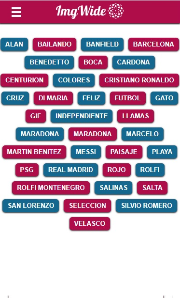
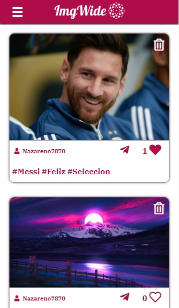

# Imgwide - Share Images and Gifs by Nazareno del Río

This is my personal project to apply my knowledge acquired in the last time.

## Table of contents

- [Overview](#overview)
  - [Features](#features)
  - [Screenshot](#screenshot)
  - [Links](#links)
- [My process](#my-process)
  - [Front End](#front-end)
  - [Back End](#back-end)
- [Author](#author)
- [Acknowledgments](#acknowledgments)

## Overview

### Features

This Single Page Application, created from scratch, is a personal project to be able to implement the knowledge acquired in the last 3 months.
The application has the following functionalities:

-User register
-Account confirmation by mail
-Password reset by mail
-User login
-Create Post (normal user with image url, admin can upload image to Imgur Api)
-Publication Composed by Image and Tags/Hashtags
-Search posts by tags
-Like the post
-Individual page for each publication
-Individual page for each User

### Screenshot

### Links

- Live Site URL: [https://imgwide.netlify.app/](https://imgwide.netlify.app/)

## My process

### Front End

- Semantic HTML5 markup
- CSS custom properties
- Flexbox
- CSS Grid
- Mobile-first workflow
- Intersection Observe to Infinite Scroll
- Vite
- [React](https://reactjs.org/) - JS library
- React Hooks
- React Router

Deploy in Netlify

### Back End
- Node JS
- Express
- Mongo DB
- Json Web Token
- Bcrypt
- NodeMailer

Deploy in Heroku

## Author

- Linkedin - [Nazareno del Rio](https://www.linkedin.com/in/nazarenodelrio/)
